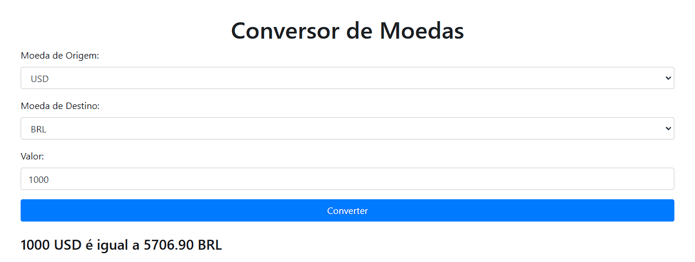

# CurrencyConverter

A simple currency converter in PHP that uses the ExchangeRate-API to fetch real-time exchange rates and convert values between different currencies. This project is developed with Bootstrap for a modern and responsive interface.

## Features

- Conversion between multiple currencies (USD, EUR, BRL, etc.)
- Real-time queries using the ExchangeRate-API
- User-friendly and responsive interface with Bootstrap
- Result displayed on the same page for an interactive experience

## Technologies Used

- PHP
- JavaScript
- Bootstrap
- ExchangeRate-API

## Prerequisites

To run this project, you will need:

- A local server (like XAMPP or MAMP) to run PHP
- An API key from [ExchangeRate-API](https://www.exchangerate-api.com/) (free registration available)

## How to Use

1. **Clone the repository:**

   ```bash
   git clone https://github.com/your-username/CurrencyConverter.git

2. **Navigate to the project folder:**

   ```bash
   cd CurrencyConverter

3. **Replace YOUR_API_KEY_HERE in the index.php file with your API key.**

4. **Start your local server and access:**

   ```bash
   http://localhost/CurrencyConverter/index.php

4. **Fill out the form fields and click "Convert" to see the results.**

## Contributions
Contributions are welcome! Feel free to open an issue or submit a pull request.

## License
This project is open-source and can be freely used, modified, and distributed under the MIT license.
